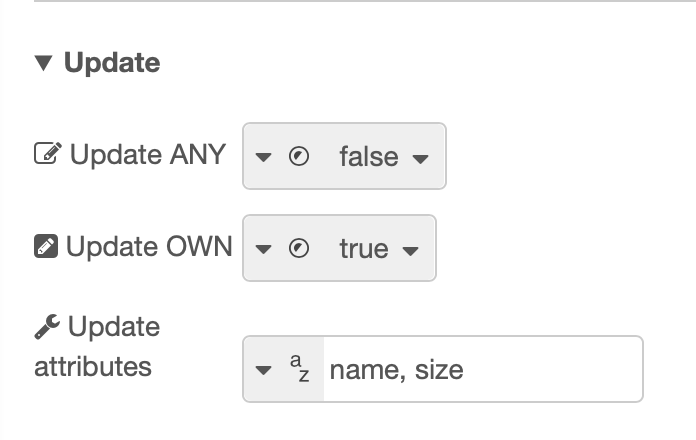

# node-red-contrib-accesscontrol
[](https://nodered.org)
[](https://badge.fury.io/js/node-red-contrib-accesscontrol)
[](https://github.com/EdoGimo/node-red-contrib-accesscontrol/graphs/commit-activity)
[](https://snyk.io/test/github/edogimo/node-red-contrib-accesscontrol)
[](https://opensource.org/licenses/MIT)

A [Node-RED](https://nodered.org/) implementation of the [accesscontrol](https://www.npmjs.com/package/accesscontrol) nmp module, providing Role Based Access Control with the addition of Attributes (see this [NIST paper](https://csrc.nist.gov/publications/detail/journal-article/2010/adding-attributes-to-role-based-access-control)). 
Also supporting export/import to/from the [MongoDB node](https://flows.nodered.org/node/node-red-node-mongodb).


### Prerequisites

Node-RED installed. Tested on version 2.0.5.


### Installation
 
Install via Node-RED Manage Palette

```
node-red-contrib-accesscontrol
```

Install via npm

```shell
$ cd ~/.node-red
$ npm install node-red-contrib-accesscontrol
```

If necessary, restart Node-RED.


## How to use
10 nodes are provided:
- **AC init**: creates the AccessControl instance that contains all permissions (as no database is used). It should be called just once for each execution, although the instance is not overwritten without explicitly specifying it checking the related option;

- **AC export**: export the AccessControl permissions as a string (JSON format). If specified, it can export with a identifier so it is possible to save the output directly into a MongoDB database, using the specific Node-RED node;

- **AC import**: import the AccessControl permissions from a string (JSON format). As for the export node, an identifier can be specified to import from MongoDB and remove that field from the JSON;

- **grant**: enables to grant to a role a CRUD action (Create, Read, Update, Delete) over a resource;

- **extend**: a quick way of granting to a role the same permissions of another role, outlining a condition of inheritance towards this;

- **deny**: drops CRUD permissions previously set with grant, along with all optionally set attributes;

- **remove**: removes either specified role(s) or resource(s) from AccessControl;

- **permission**: checks if a specific permission (**without** attributes) is implemented or not. The result output can be either true or false based on this. If true, also the attributes that are linked to the operation are returned in a separate message field;

- **permissions**: checks if multiple permissions (**with** attributes) are implemented or not;

- **AC lock**: freezes the AccessControl instance. Attempts to modify it after calling this node will fail and will be reported.

Detailed information about each node can be read in the help tab of Node-RED.

Permission are defined by specification of 5 properties:
- role: the user or group of users receiving the authorization;
- resource: what the role can or cannot interact with;
- action: how the role can interact with the resource (CRUD actions);
- possession: specifies if the role can interact with the resource of 'any' other role or just with its 'own';
- attributes: optional values related to the resource, to provide a more accurate permission.


### Flow examples
[This flow](https://flows.nodered.org/flow/735d285b1e5fbf3f5c9f2495812c4292) shows a overly simplified use case scenario.

Also, [this flow](https://flows.nodered.org/flow/d9df53b07308813a6cb28511180351ed) shows how to combine this node with the *MongoDB* one.

### Graphical example
In this section, an example of a flow containing all nodes is provided.
<hr>

First, an instance of *accesscontrol* is generated by triggering the **AC init** node, in this case using an inject node.


Then, separately, another injection node sends these values:

| Attribute name   | Value       |
| -----------      | ----------- |
| msg.role         | user        |
| msg.res          | object      |

The **grant** node can set the options using string or by obtaining the value from the msg.
In this example, it reads the injected values, granting permission of *Create ANY* to role *user* when accessing resource *object*. Attributes are not specified.


When running the inject node, the values recorded by **grant** are handled by the **permission** node, a simple implementation to test one permission per time, without attributes. If the permission is found to be correct, true is returned, as in this case, along with information about the potentially specified attributes. If it is incorrect, false is instead returned.


To check more permissions at once the **permissions** node can be used: this node's options resemble those of the **grant** node, offering the possibility to select more CRUD actions simultaneously, plus including attributes. In a new example (always in the same flow, to maintain the accesscontrol instance), a grant node adds to *user* permission to *Read ANY* and *Update OWN* over *object*. Moreover, for *Update OWN* some attributes are also specified.


**Permissions** will return true if at least one of the granted conditions is provided. In those cases where *Update ANY* permission is checked however, also the correct attributes have to be provided (all those specified or a subgroup of them). For example, in the following figure **permissions** confirms that *Read OWN* ("OWN" is logically a subgroup of "ANY") and *Update OWN* with just one of the attributes is permitted.


The **deny** node looks exactly like **grant** but does the opposite and does not consider attributes. When adding a **deny** in the previous example right after **grant**, that refuses permission of *Update OWN*, the result of the same **permissions** node becomes false.


In case of more roles, a role of higher hierarchy has at least the permissions of basic roles. To avoid the use of grant to specify this, the **extend** node can be used. In the figure, the *mod* role has the same permissions from *user*.


To remove the newly added role, the **remove** node can be used: it simply removes all the occurrences of either a role or a resource (or even more of them by providing a list) from the accesscontrol instance.


Finally, the **AC export** and **AC import** nodes. They do exactly what they are called, while also offering the support for MongoDB. After adding and removing again some permissions to offer a more diverse example of how these are exported, the node returns the JSON string that can be seen in the next figure.


After forcing re-initialization of accesscontrol and copying this JSON into the payload of an inject that triggers the **AC import** node, two **permissions** nodes return true when checking both *user* and *mod* for the previously listed permissions.


To block further changes to the set permissions (until a re-initialization of accesscontrol), the **lock** node is called. The instance cannot be unlocked. Since it is saved only in memory, changes can be made by restarting Node-RED o by forcing re-creation of the instance with **AC init**.


### Contribution

Feel free to add more options or whatever may be of use. If you find a bug, please report it on GitHub.
